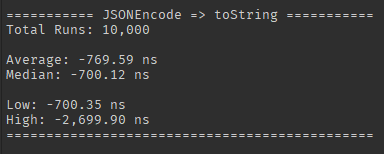

<h1 align="center">
timeIt
</h1>

> Performance timer for ROBLOX projects.

<p align="left">
<a alt="Released version" href="https://www.npmjs.com/package/@rbxts/timeit">
</a>

<a alt="Last commit date" href="https://github.com/daymxn/rbxts-timeit/commits/main/">
</a>
<a alt="Open issues" href="https://github.com/daymxn/rbxts-timeit/issues">
</a>

<a alt="License" href="https://github.com/daymxn/rbxts-timeit/blob/main/LICENSE">
</a>
</p>

---

<br>

## Demo

```ts
import { timeItReport } from "@rbxts/timeIt";
import { HttpService } from "@rbxts/services";

const sample = { name: "Daymon" };

const encodeReport = timeItReport("JSONEncode", () => {
  HttpService.JSONEncode(sample);
});

const stringReport = timeItReport("toString", () => {
  tostring(sample);
});

const comparison = encodeReport.compareTo(stringReport);

print(comparison.format({ precision: 2 }));
```



## Installation

Install `timeIt` with your preferred package manager.

### npm

```sh
npm install @rbxts/timeit
```

### pnpm

```sh
pnpm add @rbxts/timeit
```

### yarn

```sh
yarn add @rbxts/timeit
```

## Overview

timeIt is a small utility library that provides a simple API
for recording the impact some change can have on the time complexity of the
operation.

This came about as I often needed to see the measure the performance implications
of some behavior in comparison to another, and I needed a way to quickly see
the impact in an easy-to-consume manner.

> [!NOTE]
>
> Under the hood, this uses `os.clock` to measure the time it takes to run
> a given callback.
>
> This means that your timings have _sub-microsecond precision_.

## Usage

### Individual runs

You can use the `timeIt` function if you're only interested in seeing
how long it takes to run a given function once.

```ts
import { timeIt } from "@rbxts/timeIt";
import { HttpService } from "@rbxts/services";

const result = timeIt(() => {
  HttpService.JSONEncode({});
});

print(result.seconds);
```

### Multiple runs

You can use the `timeItReport` function to get a variety of data
related to how long it takes to run a given function a set amount of times.

```ts
import { timeIt } from "@rbxts/timeIt";
import { HttpService } from "@rbxts/services";

const result = timeItReport(10000, () => {
  HttpService.JSONEncode({});
});

print(result.average); // the average amount of time it took across all 10k runs
```

> [!TIP]
>
> By default, `timeItReport` runs your callback 10,000 times.
>
> If you're fine with this behavior, you don't need to pass a number.
>
> ```ts
> timeItReport(() => {
>   HttpService.JSONEncode({});
> });
> ```

#### Formatting runs

Call the `format` method to get a pretty string with all the
data pertaining to your runs.

```ts
import { timeIt } from "@rbxts/timeIt";
import { HttpService } from "@rbxts/services";

const result = timeItReport("JSONEncode", 10000, () => {
  HttpService.JSONEncode({});
});

print(result.format());
```

```text
=========== JSONEncode ===========
Total Runs: 10,000

Average: 1.237590 μs
Median: 1.200009 μs

Low: 1.199776 μs
High: 5.000038 μs
==================================
```

> [!TIP]
>
> The `TimedRunReport` class overrides the `toString` method,
> so you can also just print the report directly and get the same result.
>
> ```ts
> print(result);
> ```

##### Formatting configuration

By passing a `FormatOptions` object to your `format` call, you can
optionally configure certain behavior in how your report gets formatted.

###### Unit

Specify a specific `TimeUnit` to represent the formatted time as.

```ts
print(encodeReport.format({ unit: TimeUnit.MILLISECONDS }));
```

```text
=========== JSONEncode ===========
Total Runs: 10,000

Average: 0.003122 ms
Median: 0.003000 ms

Low: 0.002800 ms
High: 0.030200 ms
==================================
```

By default, the `"Auto"` option is selected; which automatically
decides on a per value basis which unit would be the most readable.

```text
=========== JSONEncode ===========
Total Runs: 10,000

Average: 1.12 ms
Median: 1.16 ms

Low: 200.79 μs
High: 3.12 s
==================================
```

###### Notation

Specify a specific `Notation` to represent the formatted time as.

```ts
print(encodeReport.format({ notation: Notation.FLOAT }));
```

```text
=========== JSONEncode ===========
Total Runs: 10,000

Average: 3.111480 μs
Median: 3.000001 μs

Low: 2.799999 μs
High: 30.299998 μs
==================================
```

```ts
print(encodeReport.format({ notation: Notation.SCIENTIFIC }));
```

```text
=========== JSONEncode ===========
Total Runs: 10,000

Average: 3.111480e+00 μs
Median: 3.000001e+00 μs

Low: 2.799999e+00 μs
High: 3.030000e+01 μs
==================================
```

```ts
print(encodeReport.format({ notation: Notation.SMALLEST }));
```

```text
=========== JSONEncode ===========
Total Runs: 10,000

Average: 3.11148 μs
Median: 3 μs

Low: 2.8 μs
High: 30.3 μs
==================================
```

###### Commas

Use commas for numbers larger than `1,000`.

```ts
print(encodeReport.format({ commas: true, unit: TimeUnit.NANOSECONDS }));
```

```text
=========== JSONEncode ===========
Total Runs: 10,000

Average: 3,146.319982 ns
Median: 3,000.001016 ns

Low: 2,799.999493 ns
High: 93,300.001026 ns
==================================
```

```ts
print(encodeReport.format({ commas: false, unit: TimeUnit.NANOSECONDS }));
```

```text
=========== JSONEncode ===========
Total Runs: 10000

Average: 3146.319982 ns
Median: 3000.001016 ns

Low: 2799.999493 ns
High: 93300.001026 ns
==================================
```

###### Precision

Round the output to the specified decimal place.

```ts
print(encodeReport.format({ precision: 2 }));
```

```text
=========== JSONEncode ===========
Total Runs: 10,000

Average: 3.08 μs
Median: 3.00 μs

Low: 2.80 μs
High: 30.00 μs
==================================
```

#### Comparing runs

You can use the `compareTo` function to get the diff between two reports.

```ts
import { timeItReport } from "@rbxts/timeIt";
import { HttpService } from "@rbxts/services";

const sample = { name: "Daymon" };

const encodeReport = timeItReport("JSONEncode", () => {
  HttpService.JSONEncode(sample);
});

const stringReport = timeItReport("toString", () => {
  tostring(sample);
});

const comparison = encodeReport.compareTo(stringReport);

print(comparison.format({ precision: 2 }));
```

```text
=========== JSONEncode => toString ===========
Total Runs: 10,000

Average: -788.30 ns
Median: -700.12 ns

Low: -800.01 ns
High: +21.90 μs
==============================================
```

This is especially useful when you want to see how some change in behavior
will impact the performance.

##### Additive percentage impact

You can use the `percent` format option to get an _additive percentage diff_
of the comparisons of two runs.

```ts
print(comparison.format({ percent: true, precision: 2 }));
```

```text
=========== JSONEncode => toString ===========
Total Runs: 10,000

Average: -76.32%
Median: -78.56%

Low: -78.58%
High: +112.00%
==============================================
```

> [!WARNING]
>
> This is the _additive_ difference. For example,
> the additive difference between `1` and `3` is
> `200%`. In other words, `1 + 1 * 200% = 3`.
>
> This represents the _relative_ impact of the change;
> your change had a `+200%` increase on the time
> it took to complete the operation.

## Roadmap

* Add publishing for wally
* Add docs for lua usage
* Implement workflow for test coverage (Blocked by [lune/issues/259](https://github.com/lune-org/lune/issues/259))

## Contributing

If you're interested in contributing to **timeIt**, give the [CONTRIBUTING](CONTRIBUTING.md) doc a read.

## License

[Apache 2.0](/LICENSE)
